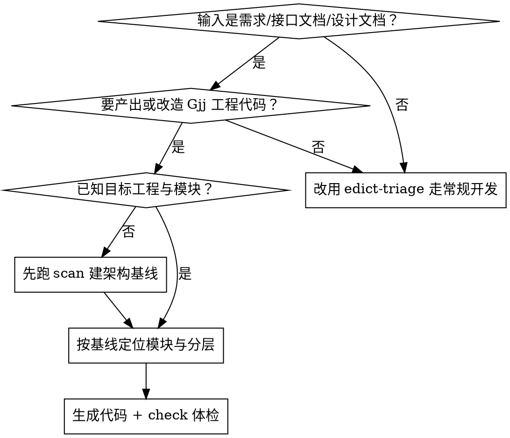

# Gjj 架构对齐代码生成

## Overview

**核心原则：先读现状，再写模板；不套用通用脚手架。**

本技能解决的是「给一个需求/接口文档/设计文档，生成贴合 Gjj 现状的代码」这件事。Gjj 是**多城市副本 + 多技术栈并存**的工程体系，凭通用 Spring Boot 模板生成的代码必然编译不过或偏离规范。因此本技能强制先扫描架构基线，再按基线生成，最后用规范体检修尾。

## When to Use



**触发信号**：
- 用户给出需求描述 / 接口文档（字段清单、请求响应示例）/ 设计文档（SDD、详细设计、数据库设计），要求「实现」「开发」「生成代码」
- 要求新增接口、新增表对应的 CRUD、新增前端页面
- 要求把某段既有代码「按项目规范改造」「自动优化」
- 需要在多城市副本（`prod` / `jiaxing` / `linyi` / `zaozhuang` / `wenzhou`）间对齐实现

**不要用**：纯文档任务、纯排查 Bug（走 `systematic-debugging`）、只改配置不写代码。

## 核心要求（最小必须）

1. **先定位，不猜路径**：必须先读 `doc/项目勘查报告/02-AI工具检索用项目图谱.md` 判断逻辑项目空间，再确认真实源码目录。**文档仓 `d:\Probject\Gjj` 不是源码仓**，不得在此新建 `src/` / `pom.xml`。
2. **先建基线，再生成**：首次进入陌生模块必须跑 `scripts/gjj_arch_scan.py scan`，以真实计数为依据，禁止凭记忆断言分层与包名。
3. **分层产物齐全**：后端一次完整功能至少覆盖 `-api`（DTO + Feign + 常量）与 `-busi`（Controller + Service + Dm + DO + Mapper）两侧，缺层必须显式说明原因。
4. **统一契约不可破**：返回 `R<T>`、入参出参 DTO 化、异常 `BizException`、Bean 转换 `JoinBeanUtil.copyBean`、Feign 必须降级且**降级不得 `return null`**。
5. **前端先判栈**：先确认目标工程是 A 栈（Vue2 + Element UI + vue-cli）还是 B 栈（Vue3 + TS + Vite + Element Plus），两套写法不得混用。
6. **金额/日期/状态位保守**：涉及金额、日期、凭证号、流水号、银行账号、中心编号、状态位的字段，必须考虑 `NULL`、空串、`0`、`0.00` 与历史脏数据差异。
7. **禁占位**：禁止 `TODO`、`...`、空方法、伪代码；禁止把本应由 Agent 完成的补全工作转嫁给用户。
8. **交付前真实验证**：Java 走 Maven 模块编译，前端走构建或类型检查；无法验证时只能写「未验证 / 仅完成局部验证」。

## 工作流（四阶段）

### 阶段 1 · 定位（Locate）
1. 读 `doc/项目勘查报告/02-AI工具检索用项目图谱.md`，判定归属：`prod` / `jiaxing` / `linyi` / `zaozhuang` / `wenzhou` / `v3`。
2. 判定任务面：后端 / 前端 / 前后端联动。
3. 确认真实源码根（如 `D:\Probject\Gjj\prod\IdeaProject`）。
4. 若涉及地区差异，读 `doc/提示词/Gjj项目-区域差异方法清单提示词.md`，确认是否要走 `RegionBusinessStrategy` 分支。

### 阶段 2 · 基线（Baseline）
```bash
python scripts/gjj_arch_scan.py scan  --root <工程根> --out <画像路径>.md
python scripts/gjj_arch_scan.py check --root <目标模块> --out <体检路径>.md
```
- `scan` 输出：模块清单（api/app/busi/core/agg 角色）、分层文件计数、包根、技术栈版本。
- `check` 输出：规范违规线索（C/S/M/D/T/F/G 七类规则）。
- **脚本版本探测可能不完整**（版本常锁在远端父 pom `capinfo-gjj-basic-dependencies`），以 `references/architecture-baseline.md` 中已核实版本为准。

### 阶段 3 · 生成（Generate）
按输入类型解析，再按分层清单生成。

**输入解析规则**

| 输入类型 | 解析动作 | 产出 |
|---|---|---|
| 需求描述 | 抽实体、字段、状态流转、校验规则 → 先补 SDD 落 `doc/设计文档/` | 需求→SDD→代码 |
| 接口文档 | 逐个接口抽：路径、方法、入参字段、出参字段、错误码 → 直接映射 Controller 方法与 DTO | 接口→方法+DTO |
| 设计文档（SDD/详细设计） | 抽模块、表结构、类图、时序 → 按已定分层落位 | 设计→骨架 |
| 数据库设计 | 抽表名/字段/类型 → 生成 DO + Mapper + XML，建表脚本落 `doc/数据库脚本/` | 表→持久层 |

**后端分层产物清单**

| 层 | 落点 | 产物 |
|---|---|---|
| 契约 | `-api` | `dto/req/XxxReqDTO`（分页则 `extends BasePage`）、`dto/resp/XxxRespDTO`、`dto/evt/XxxEvtDTO`、`constant/XxxConstant` |
| 契约 | `-api` | `client/XxxFeignClient` + `XxxFeignClientFallback` + `XxxFallbackFactory` |
| 入口 | `-busi` | `controller/XxxController`（`extends BaseController`） |
| 应用 | `-busi` | `service/XxxService`（裸接口）+ `service/impl/XxxServiceImpl` |
| 领域 | `-busi` | `domain/service/XxxDmService` + `impl/XxxDmServiceImpl`；`domain/entity/Xxx`（无后缀，可选） |
| 持久 | `-busi` | `domain/dao/XxxDO` + `domain/dao/mapper/XxxDOMapper` + 同目录 `XxxDOMapper.xml` |
| 装配 | `-app` | 仅当新增微服务才动；已有模块**不改** |

**前端产物清单**

| 栈 | 落点 |
|---|---|
| A 栈 Vue2 | `src/api/<业务域>/xxx.js`、`src/components/<业务域>/xxx.vue`（复用 `x-table` / `x-dialog` / `cap-form`） |
| B 栈 Vue3 | `src/api/<模块>/xxx.ts`、`src/views/<模块>/index.vue` + `composables/useXxx.ts` + `components/XxxDialog.vue`（复用 `ProTable`） |

模板见 `references/backend-templates.md`、`references/frontend-templates.md`。

### 阶段 4 · 验证（Verify）
1. 后端：`mvn -pl <模块> -am compile -DskipTests`（或项目规范指定命令），核对退出码与错误数。
2. 前端：`pnpm build:pro` / `npm run build`，或至少类型检查。
3. 重跑 `check`，确认新增文件未引入新的「高」级命中。
4. 输出「生成报告」规范块（见下）。

## 自动优化闭环

对既有代码做优化时，按此顺序：

1. `scan` 建基线 → 2. `check` 出违规清单 → 3. 按「高 → 中 → 低」排序，逐条回源码人工确认（**脚本只给线索**）→ 4. 最小改动修复 → 5. 编译验证 → 6. 重跑 `check` 比对。

**优先级锚点**：`F2`（Feign 降级 `return null`）、`G2`（空 catch）、`C1`（Controller 未继承 `BaseController`）、`M1`（Mapper 未继承 `IBaseMapper`）、`S1`（`ServiceImpl` 缺 `@Service`）属于高危，优先修。

## 红线（禁止清单）

- 不得在文档仓 `d:\Probject\Gjj` 下新建业务源码目录冒充代码改造。
- 不得在 Controller 里写业务逻辑（应下沉 Service/Dm）。
- 不得在 Service 里拼 SQL（复杂查询放 XML）。
- 不得返回裸实体 DO 给前端（必须转 RespDTO）。
- Feign 降级禁止 `return null`，必须 `R.fail(...)` 或抛 `BizException` 且可观测（日志）。
- 不得擅自改动 `application.yml` 中的地址、账号、密钥。
- 不得随意重命名类、方法、字段、SQL id、接口路径。
- 不得改动非本次任务相关文件，不做大范围格式化。
- 建表脚本必须含 15 个系统字段（`ID`/`ZXBH`/`REVISION`/`CREATOR`/`CREATED_TIME`/`UPDATOR`/`UPDATED_TIME`/`JBJGBH`/`JBJGMC`/`WDBH`/`WDMC`/`QDLX`/`QDBM`/`DEL_FLAG`/`HSJGBH`），表名与字段名大写不带引号。
- 文本文件统一 UTF-8 无 BOM。

## 输出规范

调用本技能后，必须在紧随其后的回复中显式输出以下块：

```markdown
## 🧬 gjj-codegen 生成报告

**定位**：逻辑项目 `prod|jiaxing|...` / 源码根 `<路径>` / 目标模块 `<模块名>` / 任务面 `后端|前端|双端`
**基线**：scan 模块数 `<n>` / check 命中 `高 n 中 n 低 n` / 技术栈 `<Java17 + Boot3.4.9 + MP3.5.14 ...>`
**输入解析**：`<需求|接口文档|设计文档>` → 抽取实体 `<n>`、接口 `<n>`、字段 `<n>`
**产物清单**：
| 文件 | 层 | 新增/修改 | 说明 |
|---|---|---|---|
| `...` | api/busi/... | 新增 | ... |
**验证**：编译 `<命令 + 退出码 + 错误数>` / check 复跑 `<高 n>` / 未验证项 `<写明>`
**风险与影响面**：`<...>`
**文档落点**：`<doc/设计文档/xxx.md>`
```

## Quick Reference

| 关注点 | 项目现状 |
|---|---|
| 包根 | `cn.capinfo.gjj.busi.<域>.<子域>.{api\|app\|busi}` |
| 模块三件套 | `-basic-svc-api` / `-basic-svc-app` / `-basic-svc-busi` |
| Controller | `@RestController @RequestMapping("/api/v1/xxx") @Tag @Slf4j` + `extends BaseController` |
| 方法 | `@PostMapping` + `@OptLog("中文")` + `@Operation` + `@Check` + `@Current CurrentUser<InnerUser>` → `R<T>` |
| Service | 裸接口 + `@Service @Slf4j` Impl + `@Transactional(rollbackFor = Exception.class)` |
| 领域服务 | `XxxDmService extends IBaseService<XxxDO>` / `XxxDmServiceImpl extends BaseServiceImpl<XxxDOMapper, XxxDO>` |
| DO | `@TableName("t_xxx") @Data extends BaseDO<XxxDO>` |
| Mapper | `extends IBaseMapper<XxxDO>`，**无 `@Mapper`**（启动类 `@MapperScan`），XML 同目录 |
| DTO | `dto/req/XxxReqDTO`、`dto/resp/XxxRespDTO`、`dto/evt/XxxEvtDTO` |
| 响应/异常 | `R.success(data)` / `R.fail(msg)` / `R.validFail(msg)`；`throw new BizException(...)` |
| Bean 转换 | `JoinBeanUtil.copyBean(src, Target.class)` |
| 校验 | DTO 字段 `@NotNull/@NotBlank/@Size` + `@Schema`；方法参数 `@Check` |
| 分页 | ReqDTO `extends BasePage`，`toPage(Class)` → MP `Page<T>` |
| 逻辑删除 | `del_flag`（`'0'` 未删 / `'1'` 已删），MP 全局配置 |
| 前端 A 栈 | Vue2 + Element UI + vue-cli + Vuex，页面在 `src/components/<业务域>/`，复用 `x-table` |
| 前端 B 栈 | Vue3 + TS + Vite + Element Plus + Pinia，页面在 `src/views/<模块>/index.vue`，复用 `ProTable` |

## Common Mistakes

| 症状 | 根因 | 修法 |
|---|---|---|
| 生成的代码包名对不上 | 凭记忆写包路径 | 先 `scan`，从包根字段取值 |
| Mapper 注入失败 | 手加了 `@Mapper` 或没继承 `IBaseMapper` | 去掉 `@Mapper`，继承 `IBaseMapper<XxxDO>` |
| 前端两种写法打架 | 未判栈就套模板 | 先看 `package.json` 判 Vue2/Vue3 |
| 分页失效 | 自己 new Page | ReqDTO 继承 `BasePage` 用 `toPage()` |
| 事务不回滚 | `@Transactional` 缺 `rollbackFor` 或写在接口上 | 写在 Impl 方法上并加 `rollbackFor = Exception.class` |
| 前端拿到 DO 内部结构 | Service 直接返回 DO | 转 RespDTO 再返回 |
| 跨城市实现漂移 | 直接照抄 prod 到 jiaxing | 先查区域差异方法清单，确认是否走策略分支 |

## 主源与配套文件

- 技能主源：`doc/技能库/gjj-codegen/SKILL.md`（本文件）
- 架构基线：`doc/技能库/gjj-codegen/references/architecture-baseline.md`
- 后端模板：`doc/技能库/gjj-codegen/references/backend-templates.md`
- 前端模板：`doc/技能库/gjj-codegen/references/frontend-templates.md`
- 扫描工具：`doc/技能库/gjj-codegen/scripts/gjj_arch_scan.py`
- 上游规则：`doc/项目规范/Gjj项目组开发规范.md`、`doc/提示词/Gjj项目组前后端项目开发提示词.md`
- 检索地图：`doc/项目勘查报告/02-AI工具检索用项目图谱.md`

## 使用提示

- 与 `edict-triage` / `edict-planning` 联动：本技能负责「怎么生成」，计划与门禁仍走三省六部。
- 中大型需求先补 SDD 落 `doc/设计文档/`，再进阶段 3。
- 子任务落盘用 `TaskCreate` / `TaskUpdate`，至少 3 步并写明完成证据。
- `check` 结果只是线索；修复后必须编译或运行真实验证，再对外汇报。
