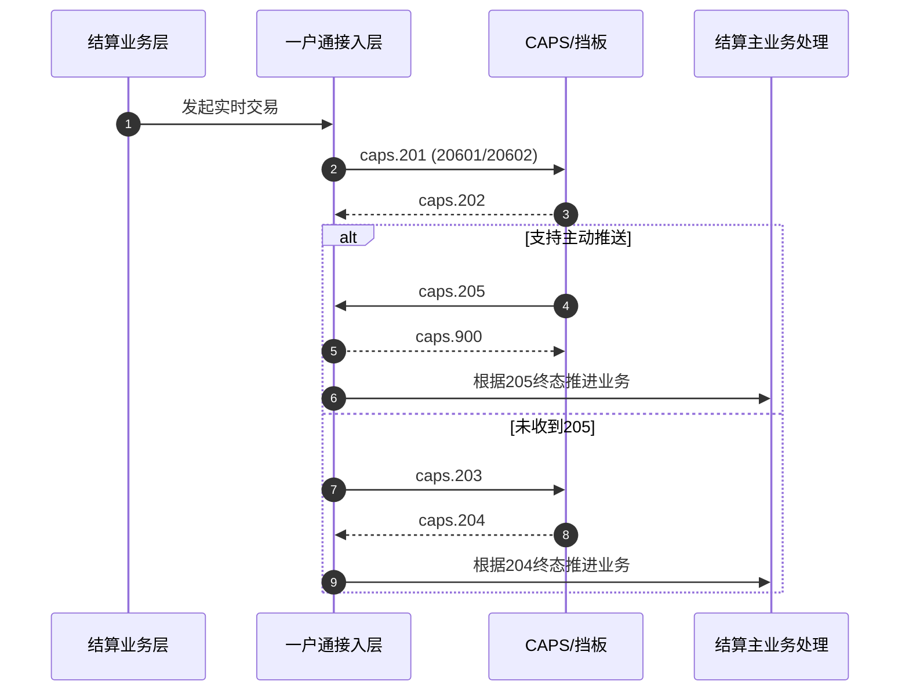
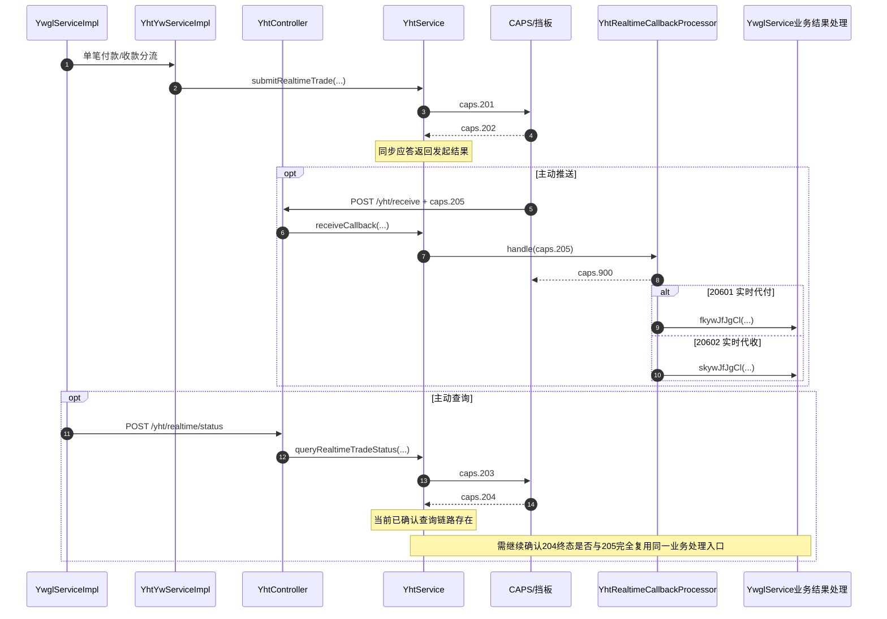
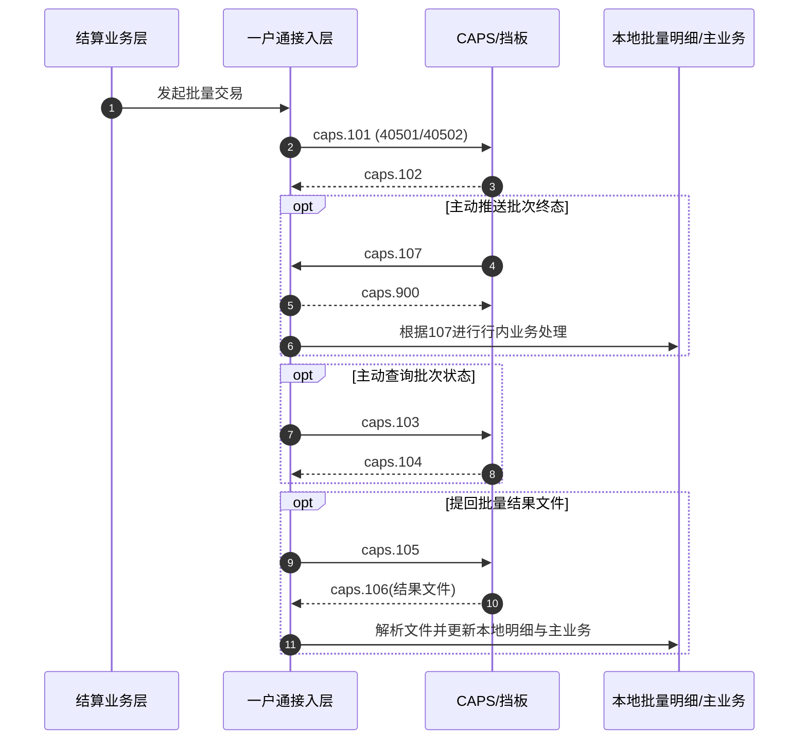
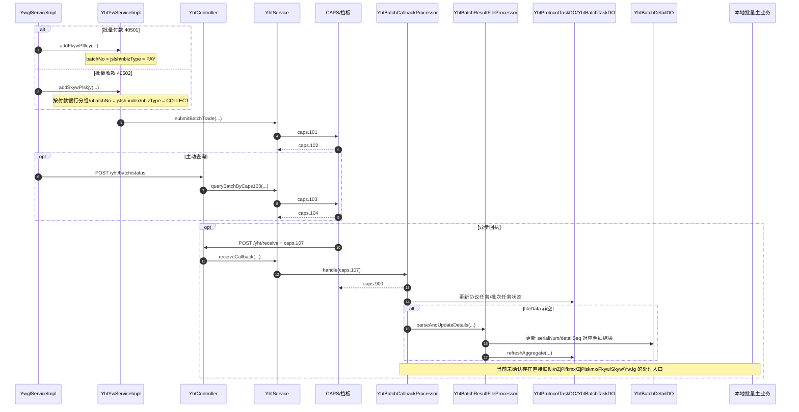
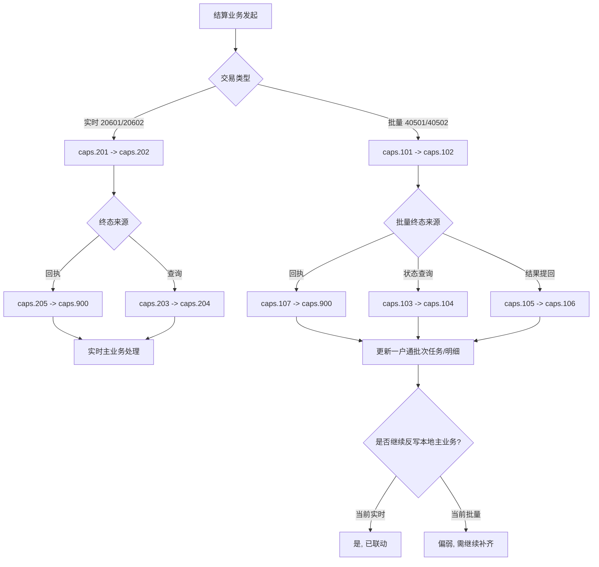

# 一户通实时与批量交易业务流程图

## 1. 目的

结合更新后的原始规范与当前项目实现，给出一户通：

1. 实时交易业务流程图；
2. 批量交易业务流程图；
3. 接口调用顺序图；
4. 当前最可能导致“业务处理不对”的断点说明。

本文重点区分两类流程：

1. **规范期望流程**
2. **当前实现实际流程**

## 2. 关键口径

### 2.1 交易码

1. `20601`：实时代付
2. `20602`：实时代收
3. `40501`：批量代付
4. `40502`：批量代收

### 2.2 报文族

#### 实时交易

1. `caps.201`：实时交易申请
2. `caps.202`：实时交易应答
3. `caps.203`：实时交易查询
4. `caps.204`：实时交易查询应答
5. `caps.205`：实时交易处理结果回执
6. `caps.900`：回执确认

#### 批量交易

1. `caps.101`：批量交易申请
2. `caps.102`：批量交易应答
3. `caps.103`：批量状态查询
4. `caps.104`：批量状态查询应答
5. `caps.105`：批量结果提回
6. `caps.106`：批量结果提回应答
7. `caps.107`：批量处理结果回执
8. `caps.900`：回执确认

## 3. 实时交易流程图

### 3.1 规范期望流程

### 3.2 当前实现流程

### 3.3 实时交易当前判断

实时交易当前的主链路已经比较完整：

1. `caps.201/202` 已具备；
2. `caps.203/204` 已具备；
3. `caps.205` 已具备；
4. `20601/20602` 的 `caps.205` 回执已能联动主业务处理。

当前更值得怀疑的点不是“回执没接到”，而是：

1. `caps.203` 构文是否完全符合最新规范；
2. `caps.204` 查询终态和 `caps.205` 回执终态是否真的落到同一套业务处理逻辑。

## 4. 批量交易流程图

### 4.1 规范期望流程

### 4.2 当前实现流程

### 4.3 批量交易当前判断

批量交易目前最像下面这种状态：

1. `101/102` 前半段已经通；
2. `103/104` 批量状态查询已经有；
3. `107` 回执接收已经有；
4. 结果文件解析和一户通批次明细台账收敛已经有；
5. 但“批量终态 -> 本地批量业务明细 -> 主业务结果处理”这条后半段没有看到清晰闭环。

## 5. 你现在最该怀疑的断点

### 5.1 如果是实时业务感觉处理不对

优先排查：

1. 是否真的收到了 `caps.205`
2. `YhtRealtimeCallbackProcessor` 是否命中了本地唯一任务
3. 任务状态是否进入最终态
4. 是否调用了：
   - `fkywJfJgCl(...)`
   - `skywJfJgCl(...)`
5. 如果没收到 `205`，`203/204` 查询终态是否真的推进了主业务

### 5.2 如果是批量业务感觉处理不对

优先排查：

1. 是否收到 `caps.107`
2. `YhtBatchTaskDO` 是否更新了 `batchStatus`
3. `YhtBatchDetailDO` 是否更新了 `bizStatus/retCode/retMsg`
4. 本地业务明细：
   - `ZjPlfkmx`
   - `ZjPlskmx`
   是否完全没变化
5. 主业务：
   - `Fkyw`
   - `Skyw`
   - `YwJg`
   是否仍停留在交易中

如果出现下面这种现象：

1. 一户通批次任务和批次明细都更新了；
2. 但本地批量明细和主业务没变化；

那么高度怀疑：

当前批量链路只完成了“一户通台账收敛”，没有完成“结算主业务处理”。

## 6. 一张总图

## 7. 对应源码入口

### 7.1 控制器入口

1. 实时发起：[YhtController.submitRealtimeTrade](file:///home/source/Jetbrains/Probject/Gjj/prod/IdeaProjects/capinfo-gjj-busi-jshs/capinfo-gjj-busi-zjjs-ywgl/capinfo-gjj-busi-zjjs-ywgl-basic-svc-busi/src/main/java/cn/capinfo/gjj/busi/zjjs/ywgl/busi/yht/controller/YhtController.java#L315-L366)
2. 实时查询：[YhtController.queryRealtimeTradeStatus](file:///home/source/Jetbrains/Probject/Gjj/prod/IdeaProjects/capinfo-gjj-busi-jshs/capinfo-gjj-busi-zjjs-ywgl/capinfo-gjj-busi-zjjs-ywgl-basic-svc-busi/src/main/java/cn/capinfo/gjj/busi/zjjs/ywgl/busi/yht/controller/YhtController.java#L368-L402)
3. 批量发起：[YhtController.submitBatchTrade](file:///home/source/Jetbrains/Probject/Gjj/prod/IdeaProjects/capinfo-gjj-busi-jshs/capinfo-gjj-busi-zjjs-ywgl/capinfo-gjj-busi-zjjs-ywgl-basic-svc-busi/src/main/java/cn/capinfo/gjj/busi/zjjs/ywgl/busi/yht/controller/YhtController.java#L404-L456)
4. 批量查询：[YhtController.queryBatchStatus](file:///home/source/Jetbrains/Probject/Gjj/prod/IdeaProjects/capinfo-gjj-busi-jshs/capinfo-gjj-busi-zjjs-ywgl/capinfo-gjj-busi-zjjs-ywgl-basic-svc-busi/src/main/java/cn/capinfo/gjj/busi/zjjs/ywgl/busi/yht/controller/YhtController.java#L458-L492)
5. 回执接收：[YhtController.receive](file:///home/source/Jetbrains/Probject/Gjj/prod/IdeaProjects/capinfo-gjj-busi-jshs/capinfo-gjj-busi-zjjs-ywgl/capinfo-gjj-busi-zjjs-ywgl-basic-svc-busi/src/main/java/cn/capinfo/gjj/busi/zjjs/ywgl/busi/yht/controller/YhtController.java#L494-L532)

### 7.2 回执处理入口

1. 实时回执：[YhtRealtimeCallbackProcessor](file:///home/source/Jetbrains/Probject/Gjj/prod/IdeaProjects/capinfo-gjj-busi-jshs/capinfo-gjj-busi-zjjs-ywgl/capinfo-gjj-busi-zjjs-ywgl-basic-svc-busi/src/main/java/cn/capinfo/gjj/busi/zjjs/ywgl/busi/yht/processor/realtime/YhtRealtimeCallbackProcessor.java#L40-L164)
2. 批量回执：[YhtBatchCallbackProcessor](file:///home/source/Jetbrains/Probject/Gjj/prod/IdeaProjects/capinfo-gjj-busi-jshs/capinfo-gjj-busi-zjjs-ywgl/capinfo-gjj-busi-zjjs-ywgl-basic-svc-busi/src/main/java/cn/capinfo/gjj/busi/zjjs/ywgl/busi/yht/processor/batch/YhtBatchCallbackProcessor.java#L42-L118)
3. 批量结果文件解析：[YhtBatchResultFileProcessor](file:///home/source/Jetbrains/Probject/Gjj/prod/IdeaProjects/capinfo-gjj-busi-jshs/capinfo-gjj-busi-zjjs-ywgl/capinfo-gjj-busi-zjjs-ywgl-basic-svc-busi/src/main/java/cn/capinfo/gjj/busi/zjjs/ywgl/busi/yht/processor/batch/YhtBatchResultFileProcessor.java#L79-L204)

## 8. 一句话结论

如果你现在感觉“业务处理不对”，按当前证据看：

1. **实时交易** 更可能是构文/查询终态处理口径问题；
2. **批量交易** 更可能是“回执和结果文件只更新了一户通台账，但没有继续推进结算主业务”的结构性断点。
