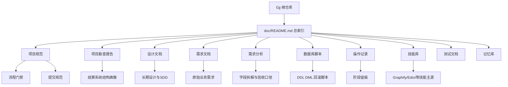
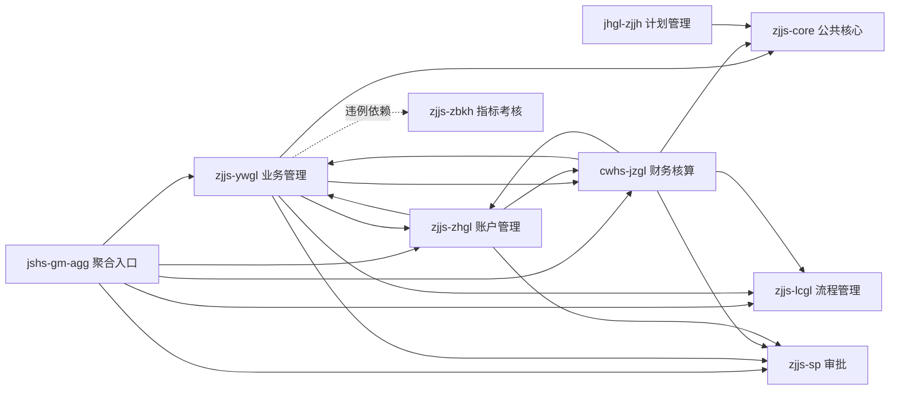
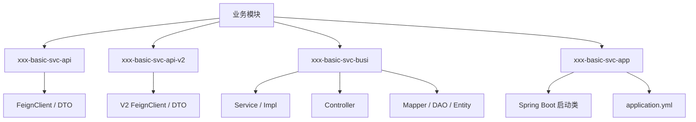
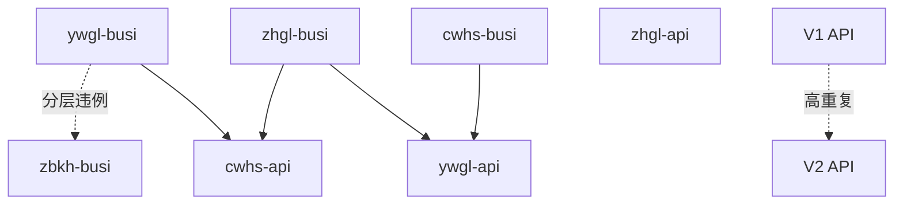
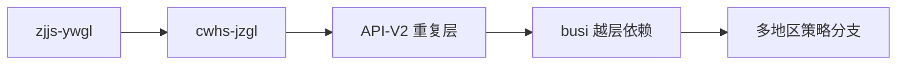
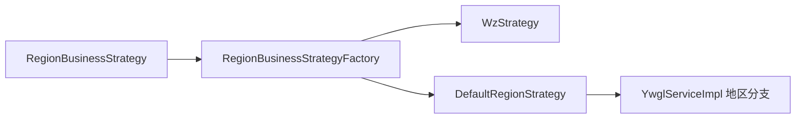

# 20260705-Graphify-项目图谱

## 说明

本图谱基于当前工作区已落盘资料生成，遵循 `Graphify` 本地桥接技能的约束。

- 当前仓库已安装 `Graphify` 本地技能入口
- 当前机器缺少 `python`、`uv` 与官方 `graphify` CLI
- 因此本次产物为 **Graphify 风格项目图谱**，即基于现有文档与勘查结果生成的结构化图谱

## 一、当前工作区图谱

当前 `d:\Probject\Gjj` 实际是一个文档仓，而不是业务源码仓。



### 当前工作区结论

- 图谱中心不是 Java 类，而是 `doc/` 目录下的知识节点
- `doc/项目勘查报告/` 是连接“文档仓”与“目标业务系统”的桥梁
- 如果没有补充真实源码路径，后续图谱仍将以文档知识关系为主

## 二、目标业务系统模块图谱

以下图谱对应 `doc/项目勘查报告/01-项目结构勘查报告.md` 中描述的 `capinfo-gjj-busi-jshs` 结算系统。



### 模块中心度判断

按“体量 + 连接度 + 业务关键性”综合评估，模块优先级如下：

1. `zjjs-ywgl`
2. `cwhs-jzgl`
3. `zjjs-zhgl`
4. `jshs-gm-agg`
5. `zjjs-core`

其中 `zjjs-ywgl` 与 `cwhs-jzgl` 合计占总代码量 71.4%，是最重要的两个中心节点。

## 三、标准分层骨架图谱

每个主业务模块普遍遵循相同的四层结构，这也是后续做源码级 `Graphify` 时最适合采用的主骨架。



### 分层观察

- `API` 与 `API-V2` 节点在多个模块中高度重复
- `BUSI` 层承担了绝大多数复杂逻辑，是热点聚集区
- `APP` 层更像部署与启动壳，业务中心性较低

## 四、风险关系图谱

下图用于表达当前系统最值得优先治理的关系。



### 风险解释

- `ywgl-busi` 与 `cwhs-busi` 存在高耦合关系，容易形成循环依赖
- `ywgl-busi -> zbkh-busi` 属于跨模块 `busi -> busi` 直接依赖
- `V1 API` 与 `V2 API` 的重复会稀释真正的主干节点

## 五、建议阅读路径图谱

### 1. 面向业务链路


适合回答“请求从哪里进入、如何流转、最终如何记账”。

### 2. 面向重构治理



适合回答“哪里最臃肿、哪里最应该优先拆分”。

### 3. 面向地区差异



适合回答“地区差异如何落在代码结构上”。

## 六、当前图谱边界

本次项目图谱仍有明确边界：

1. 图谱依据主要来自 `doc/` 下的文档与勘查结论
2. 未直接读取 `capinfo-gjj-busi-jshs` 的真实源码树
3. 未执行官方 `graphify .` 命令，因此未生成交互式图谱页或结构化 JSON

## 七、后续升级路径

若后续提供真实业务源码目录，并补齐 Python 与 `uv` 环境，可把本图谱升级为真正的源码级 `Graphify` 图谱：

```powershell
uv tool install graphifyy
graphify install --project
graphify .
```

升级后可继续输出：

- 模块依赖图
- 类与方法热点图
- Controller -> Service -> Mapper 主链路图
- 多地区分支与渠道分支的聚类图

## 参考资料

- `doc/技能库/graphify/SKILL.md`
- `doc/操作记录/20260705-Graphify-skill安装记录.md`
- `doc/操作记录/20260705-Graphify-大项目图谱分析记录.md`
- `doc/项目勘查报告/01-项目结构勘查报告.md`
