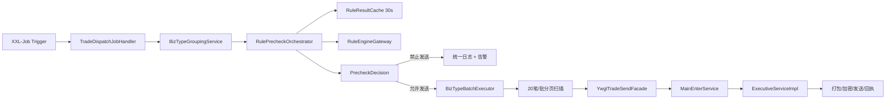
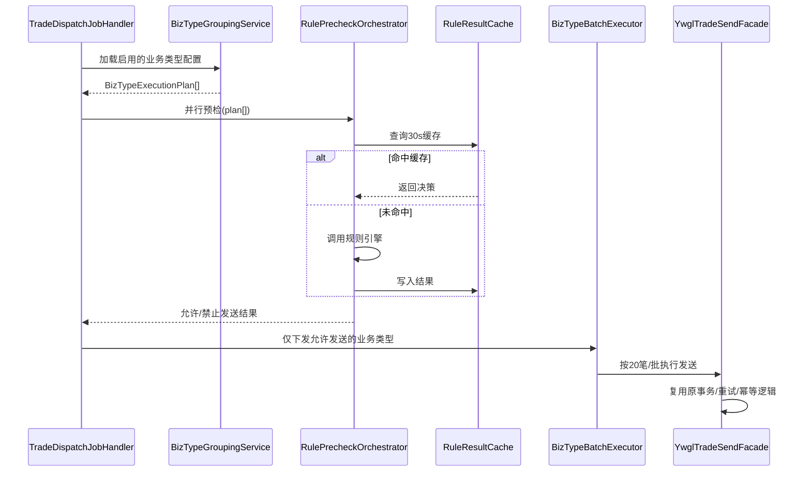

# 自动发交易任务“业务类型分组 + 规则引擎驱动”优化方案

**文档编号**：GJJ-ZJJS-YWGL-ARCH-20260427-01  
**适用范围**：`capinfo-gjj-busi-zjjs-ywgl` 自动发交易任务链路  
**当前状态**：送审稿 V1.0  
**编制日期**：2026-04-27  
**编制人**：Trae Agent

## 1. 背景与目标

当前自动发交易任务主要由 `ZjbPlywJobHandler` 与 `ZjbDbywJobHandler` 触发，分别负责批量业务与单笔业务的待发送交易扫描。现有实现已经具备“按 20 笔分页扫描、按执行编码过滤、调用服务发送”的基础能力，但仍存在以下问题：

- 业务分类语义隐式依赖 `plbj + execode/txcode + isSearch` 组合条件，扩展新业务类型时需要修改多个 JobHandler 与硬编码列表。
- 规则引擎调用发生在单笔循环内部，无法在任务启动阶段完成“整组预检”和“整组熔断”。
- JobHandler 间存在高重复逻辑，当前仅通过不同的 `plbj` 和编码清单区分业务。
- 规则版本、并发度、权重、批次大小等缺少统一配置中心治理。
- 可观测性不足，日志未形成统一 JSON 埋点，缺少按业务类型的监控视图。

本方案目标是在保留现有事务、重试和发送出口能力的前提下，引入“业务类型分组 + 规则引擎驱动”的统一调度层，实现以下能力：

- 业务类型显式建模，可持续扩展到 `Plyw`、`Dbyw` 以及未来新类型。
- 任务启动时先按业务类型分组并并行预检，整组禁止发送的业务类型直接过滤。
- 对可发送业务类型仍沿用现有 `20` 笔/批的发送粒度与原子性、幂等性处理方式。
- 支持规则热加载、灰度切换、快速回退与统一监控。

## 2. 现状深度分析

### 2.1 当前调度入口

当前发送任务入口分为以下四类：

- `ZjbPlywJobHandler`
  - `plbj = SF_S`
  - `fszt = 0`
  - `size = 20`
  - `current = 1`
  - `isSearch = false`
  - 通过 `exeCodes` 排除单笔业务编码，保留批量发送业务
- `ZjbDbywJobHandler`
  - `plbj = SF_F`
  - 其他查询条件与批量任务一致
  - 通过 `exeCodes` 仅保留单笔发送业务
- `ZjbPlJycxJobHandler`
  - `plbj = SF_S`
  - `isSearch = true`
  - 使用 `txCodes` 扫描批量查询任务
- `ZjbJycxJobHandler`
  - `plbj = SF_F`
  - `isSearch = true`
  - 使用 `txCodes` 扫描单笔查询任务

结论：

- 现有调度框架已经采用 `XXL-Job + @XxlJob`，JobHandler 仅负责组装筛选条件并调用 `YwglService.jyfs`，符合“任务触发与业务执行分离”的基本原则。
- 但当前“业务类型”的真实语义散落在 4 个 JobHandler 的硬编码列表中，并未形成领域对象。

### 2.2 当前核心数据模型

当前扫描与发送依赖实体 `ZjJycsh`，其关键字段如下：

- `execode`：执行编码，决定后续路由到哪个执行器 Bean。
- `txcode`：交易代码。
- `fszt`：发送状态；当前任务扫描未发送记录时使用 `0`。
- `yhdm`：银行代码。
- `sqbid`：业务申请主键。
- `crsj`：初始化记录生成时间，同时作为定时扫描时间阈值。
- `jslsh`：结算流水号，是业务聚合与幂等关联的重要键。
- `plbj`：批量标记，当前用于区分单笔与批量。
- `exeCodes` / `txCodes`：仅存在于实体层的运行时筛选集合，并不落库。
- `isSearch`：查询标记；通过 `execode like '%_%'` 与 `not like '%_%'` 间接区分“查询类”与“发送类”任务。

对应持久化表为 `zjjs_zj_jycsh`，落库字段相对精简，仅包含真正的初始化记录属性，不包含运行时筛选集合。

### 2.3 当前查询与分组逻辑

`ZjJycshDmServiceImpl.selectList` 的查询规则体现了现状链路的关键约束：

1. 基础过滤：
   - `fszt`
   - `crsj <= 当前时间`
   - `jslsh`
   - `execode`
   - `txCodes in`
2. 单笔/批量区分：
   - `plbj = SF_F` 时，对 `execode` 执行 `in exeCodes`
   - `plbj = SF_S` 时，对 `execode` 执行 `not in exeCodes`
3. 查询/发送区分：
   - `isSearch = true` 时，使用 `execode like '%_%'`
   - `isSearch = false` 时，使用 `execode not like '%_%'`
4. 顺序与分页：
   - 按 `crsj` 升序
   - 按 `size/current` 分页，当前 Job 固定取第一页的 `20` 笔

现状问题：

- `plbj` 与 `exeCodes` 组合的语义不直观，新业务类型加入时很容易误入“排除式”匹配。
- “是否查询”依赖 `execode` 是否带下划线，属于编码约定外溢，不适合作为长期扩展机制。
- 当前只取第一页，若某类业务高堆积，低优先级业务会长期饥饿。

### 2.4 当前发送执行链

`YwglServiceImpl.jyfs` 的执行链可概括为：

1. 根据 `ZjJycsh` 条件查询待处理记录。
2. 对每条记录构造 `id + jslsh` 参数。
3. 先查付款业务详情 `fkywDmService.getFkywXq`，若为空再查收款业务详情 `skywDmService.getSkywXq`。
4. 调用 `ywglDmService.ruleExec(RULEID_JYKZ_ID, RULEID_JYKZ_VERSION, respDTO)` 执行交易控制规则。
5. 若命中控制规则且满足取消条件，则按收/付款类型调用 `skJyCx` / `fkJyCx` 取消交易。
6. 若允许继续发送，则调用 `mainEnterService.call(yhdm, txcode, execode, sqbid, cshId)`。
7. `MainEnterServiceImpl` 根据 `execode` 从 Spring 容器获取对应 `ExecutiveServiceImpl` Bean，执行具体的打包、加密、发送与回执链路。

结论：

- 现有系统已经内置规则引擎，但它是“单笔内联式控制”，不是“任务级分组预检”。
- 真正的发送出口已经被 `MainEnterService` 统一收口，说明本次重构不必动各个 `ExecutiveServiceImpl` 的业务细节，只需在调度与预检层增强即可。

### 2.5 当前调度机制结论

当前架构的本质是：

`XXL-Job JobHandler -> 查询初始化表 -> 单笔取业务详情 -> 单笔规则判断 -> 逐笔路由执行器`

优点：

- 触发简单，历史兼容性好。
- 执行器路由稳定，业务编码已经沉淀多年。
- 每次只处理 `20` 笔，天然限制单次事务规模。

短板：

- 缺少“业务类型”这一中间抽象层。
- 无法先整体判断“这一组业务今天能不能发”。
- 无统一的权重、优先级、并发和灰度开关。
- 无结构化监控模型。

## 3. 设计原则

- 保持 JobHandler 只负责触发，不直接承载复杂业务。
- 保持原有发送执行器、事务边界和重试逻辑不被破坏。
- 新能力优先通过“编排层 + 配置层 + 规则层”叠加，不做大爆炸替换。
- 所有阈值与开关配置化，支持 Apollo/Nacos 动态推送。
- 默认失败安全策略为“规则异常不阻断发送，但必须告警”。

## 4. 总体方案

### 4.1 架构概览



### 4.2 重构后的职责分层

- `TradeDispatchJobHandler`
  - 仅负责触发总调度，不再硬编码大量业务编码列表。
- `BizTypeGroupingService`
  - 从配置中心读取业务类型定义与分组规则。
  - 将原始任务拆分为多个 `BizTypeExecutionPlan`。
- `RulePrecheckOrchestrator`
  - 按业务类型并行执行预检。
  - 负责缓存、超时控制、熔断、灰度版本选择。
- `BizTypeBatchExecutor`
  - 对预检通过的业务类型执行实际发送。
  - 维持现有 `20` 笔/批策略与重试边界。
- `YwglTradeSendFacade`
  - 对现有 `YwglService.jyfs` 做适配封装，保留原发送链路。
- `RuleEngineGateway`
  - 对外屏蔽规则中心协议差异，统一返回标准决策模型。

## 5. 业务类型分组策略

### 5.1 可扩展业务类型枚举

建议新增显式枚举 `BizTypeEnum`：

```java
public enum BizTypeEnum {
    PLYW("Plyw", "批量发送业务"),
    DBYW("Dbyw", "单笔发送业务"),
    PLCX("Plcx", "批量查询业务"),
    DBCX("Dbcx", "单笔查询业务"),
    YQFK("Yqfk", "逾期补发业务"),
    MANUAL("Manual", "人工补发业务");
}
```

设计说明：

- 枚举只定义稳定语义，不直接绑定具体 `execode`/`txcode` 列表。
- 具体业务映射、默认权重、优先级、并发度由配置中心覆盖。
- 后续新增类型仅需新增枚举值与配置，无需复制 JobHandler。

### 5.2 业务类型分组对象

建议新增运行时对象 `BizTypeExecutionPlan`：

- `bizType`
- `tradeMode`：发送 / 查询
- `plbj`
- `includeExecodes`
- `excludeExecodes`
- `txCodes`
- `batchSize`
- `priority`
- `weight`
- `maxConcurrency`
- `ruleProfile`
- `enabled`

### 5.3 权重与优先级策略

采用“优先级优先、权重均衡”的双层调度：

1. 先按 `priority` 从高到低排序。
2. 同优先级内按 `weight` 进行加权轮询。
3. 每个业务类型每轮最多领取 `weight * batchSize` 条初始化记录。

建议默认值：

| 业务类型 | priority | weight | maxConcurrency |
|---|---:|---:|---:|
| Dbyw | 100 | 5 | 2 |
| Plyw | 90 | 3 | 1 |
| Dbcx | 70 | 2 | 2 |
| Plcx | 60 | 1 | 1 |

设计收益：

- 单笔高时效交易优先；
- 批量业务不会因单笔洪峰永久饿死；
- 后续支持城市或银行维度差异化配置。

## 6. 规则引擎集成规范

### 6.1 调用接口

建议统一抽象接口：

```java
public interface RuleEngineGateway {
    RuleDecisionResult precheck(RuleDecisionRequest request);
}
```

#### 入参模型

- `bizType`：业务类型
- `tradeFeatures`
  - `execode`
  - `txcode`
  - `bankCode`
  - `tradeAmountLevel`
  - `isSearch`
  - `taskWindow`
  - `retryCount`
- `customerAttributes`
  - `customerType`
  - `riskLevel`
  - `regionCode`
  - `channelCode`
- `ruleContext`
  - `ruleSetId`
  - `candidateVersions`
  - `grayTag`
  - `requestTime`

#### 出参模型

- `allowSend`：是否允许发送
- `reasonCode`：原因码
- `reasonDesc`：原因描述
- `extraActions`
  - `ALARM`
  - `REQUIRE_MANUAL_REVIEW`
  - `DOWNGRADE_NO_RULE`
  - `LIMIT_CONCURRENCY`
  - `FORCE_QUERY_ONLY`
- `ruleVersion`
- `costMs`

### 6.2 规则热加载机制

建议采用“规则注册表 + 配置监听 + 双缓冲切换”：

1. Apollo/Nacos 推送新的规则版本元数据。
2. `RuleRegistryRefresher` 拉取新版本并做结构校验。
3. 新版本进入 `staging` 缓冲区。
4. 健康检查通过后切换为 `active`。
5. 旧版本在保留窗口内继续可回滚。

### 6.3 版本灰度机制

灰度粒度建议支持以下维度：

- 按 `bizType`
- 按 `bankCode`
- 按 `regionCode`
- 按流量百分比

灰度示例：

- `Dbyw` 使用 `v2.3` 全量；
- `Plyw` 先 `20%` 灰度到 `v2.3`；
- 其余保持 `v2.2`。

### 6.4 超时与容错规范

- 超时时间 `>= 500 ms` 视为预检失败。
- 规则接口异常、超时、反序列化失败时：
  - 默认返回“允许发送”；
  - 写入 `ruleFallback = true`；
  - 触发告警；
  - 增加失败指标。

## 7. 任务执行流程重构

### 7.1 新流程



### 7.2 预检阶段

预检逻辑：

1. 先按业务类型生成分组计划。
2. 为每个业务类型抽取代表性交易特征与客户属性。
3. 并行调用规则引擎。
4. 若返回“不发送”，则整组业务在当前调度周期被过滤，并记录原因码。
5. 若返回“发送”，进入批量发送阶段。

说明：

- 预检是“组级准入”，不是替代原有单笔链路的全部规则。
- 原有 `jyfs` 内部已有交易控制逻辑，可作为第二道保险继续保留。

### 7.3 批量发送阶段

对预检通过的业务类型：

1. 按当前 `20` 笔/批分页扫描。
2. 每个业务类型独立控制分页游标。
3. 调用 `YwglTradeSendFacade.sendByBizType(plan)`。
4. `YwglTradeSendFacade` 内部仍使用现有 `selectList + mainEnterService.call` 机制。
5. 原有事务与重试逻辑保持不变。

### 7.4 原子性与幂等性保护

必须保留的旧能力：

- 初始化表 `zjjs_zj_jycsh` 仍作为发送来源与重试基表。
- 同一 `jslsh + execode + sqbid` 的幂等约束不放松。
- 发送成功、失败、回执处理的状态迁移逻辑不改变。
- 查询类任务仍由查询业务类型承接，不与发送类混跑。

## 8. 并发与性能控制

### 8.1 并行预检

新增线程池 `bizTypePrecheckExecutor`：

- 核心线程数：配置化，默认 `4`
- 最大线程数：配置化，默认 `8`
- 队列长度：配置化，默认 `100`
- 拒绝策略：`CallerRunsPolicy`

并发模型：

- 一个业务类型对应一个预检任务；
- 同一轮调度中，业务类型间并行；
- 同一业务类型内部预检不拆分，避免规则结果失真。

### 8.2 预检缓存

缓存键建议为：

`bizType + ruleVersion + bankCode + featureHash + customerSegment`

缓存规则：

- TTL = `30s`
- 命中后直接复用
- 规则版本切换时主动失效

### 8.3 发送阶段限流

发送阶段保持现有 QPS 限流策略不动，仅增加按业务类型的并发闸门：

- 全局 QPS：沿用历史配置
- 业务类型并发：新增 `bizType.maxConcurrency`
- 业务类型队列上限：新增 `bizType.queueSize`

## 9. 日志、埋点与监控

### 9.1 统一 JSON 日志字段

预检、规则决策、批量发送三个阶段统一输出 JSON 日志，至少包含：

- `taskId`
- `bizType`
- `ruleResult`
- `reasonCode`
- `ruleVersion`
- `costMs`
- `batchNo`
- `recordCount`
- `fallback`
- `traceId`

示例：

```json
{
  "event": "trade_precheck",
  "taskId": "20260427-090000-001",
  "bizType": "Dbyw",
  "ruleResult": "ALLOW",
  "reasonCode": "PASS",
  "ruleVersion": "v2.3",
  "costMs": 83,
  "batchNo": "DBYW-0001",
  "recordCount": 20,
  "fallback": false
}
```

### 9.2 Grafana 大盘

新增指标：

- 规则拦截率
- 业务类型发送量
- 平均预检延迟
- 平均发送延迟
- 失败率
- 规则降级次数
- 无规则模式开关状态

推荐面板拆分：

- 总览面板
- 按业务类型面板
- 规则引擎健康面板
- 回退与告警面板

## 10. 异常与回退策略

### 10.1 规则异常兜底

- 超时 `>= 500 ms` 或异常时，默认按“可发送”处理。
- 但必须：
  - 打错误日志；
  - 发送监控告警；
  - 记录 `fallback = true`。

### 10.2 一键回退

新增全局开关：

- `trade.dispatch.rule.enabled = true/false`

回退行为：

- 关闭后直接跳过预检阶段；
- 业务回到原有 `JobHandler -> jyfs` 模式；
- 仅保留日志埋点，不参与决策。

### 10.3 分级降级

除全局关闭外，再支持：

- 按 `bizType` 关闭规则
- 按银行关闭规则
- 仅关闭灰度版本，回退到稳定版本

## 11. 配置化管理

### 11.1 配置项清单

建议纳入 Apollo/Nacos 的配置项：

```yaml
trade.dispatch:
  rule:
    enabled: true
    endpoint: http://rule-engine/api/precheck
    timeout-ms: 500
    cache-ttl-seconds: 30
    active-version: v2.3
  precheck:
    core-pool-size: 4
    max-pool-size: 8
    queue-size: 100
  default-batch-size: 20
  biz-types:
    - code: Dbyw
      enabled: true
      priority: 100
      weight: 5
      max-concurrency: 2
      plbj: F
      search: false
      include-execodes: [bdc101, bdc102, bdc109, ecs225]
    - code: Plyw
      enabled: true
      priority: 90
      weight: 3
      max-concurrency: 1
      plbj: S
      search: false
      exclude-execodes: [bdc101, bdc102, bdc109, ecs225]
```

### 11.2 动态推送要求

- 配置变化后无需重启服务；
- 新配置需经过合法性校验；
- 配置校验失败时保留上一版生效配置；
- 关键开关切换必须记录审计日志。

## 12. 建议新增模块与代码 Diff 规划

### 12.1 新增模块

建议新增以下类：

- `busi/wbjk/job/TradeDispatchJobHandler`
- `busi/wbjk/dispatch/BizTypeEnum`
- `busi/wbjk/dispatch/BizTypeExecutionPlan`
- `busi/wbjk/dispatch/BizTypeGroupingService`
- `busi/wbjk/dispatch/RulePrecheckOrchestrator`
- `busi/wbjk/dispatch/RuleEngineGateway`
- `busi/wbjk/dispatch/RuleDecisionRequest`
- `busi/wbjk/dispatch/RuleDecisionResult`
- `busi/wbjk/dispatch/BizTypeBatchExecutor`
- `busi/wbjk/dispatch/YwglTradeSendFacade`
- `busi/config/TradeDispatchProperties`

### 12.2 修改点

建议修改以下现有类：

- `ZjbPlywJobHandler`
  - 逐步改为兼容入口，内部委托统一调度器
- `ZjbDbywJobHandler`
  - 同上
- `YwglServiceImpl`
  - 抽出 `jyfs` 的“按条件发送”公共能力，便于 `Facade` 调用
- `ZjJycshDmServiceImpl`
  - 增加按业务类型计划构建查询条件的适配方法

### 12.3 改造策略

采用“三阶段迁移”：

1. 并行引入新调度链路，但旧 Job 保留。
2. 新链路灰度接管部分业务类型。
3. 验证通过后，将旧 Job 改为桥接调用或下线。

## 13. 测试与验收标准

### 13.1 单元测试

必须覆盖：

- `10+` 种业务类型组合
- `20+` 条规则组合
- 规则允许 / 拦截 / 超时 / 异常 / 灰度 / 回退
- 权重调度与优先级计算
- 配置热加载与缓存失效

验收口径：

- 规则拦截率 `100%` 符合预期
- 缓存命中与失效逻辑符合配置

### 13.2 集成测试

场景：

- 模拟 `1w` 笔交易
- 并发 `4` 个业务类型
- 规则中心正常、超时、异常三类场景混合

指标：

- CPU `<= 60%`
- RT `<= 800 ms`
- 零数据错发
- 预检失败时仍可按兜底策略稳定发送

### 13.3 评审评分表

| 维度 | 分值 |
|---|---:|
| 功能完整性 | 30 |
| 性能 | 20 |
| 可维护性 | 20 |
| 可扩展性 | 15 |
| 监控与应急 | 15 |
| 总分 | 100 |

准入标准：

- 总分 `>= 95` 方可进入实施阶段。

## 14. 交付物清单

本次送审需提交：

1. 详细设计文档
   - 含现状分析、时序图、类图、配置样例
2. 代码 Diff 说明
   - 新增模块
   - 修改点
   - 迁移策略
3. 测试报告模板
   - 单测、集成、压测口径
4. 上线步骤与回滚方案
   - 灰度步骤
   - 开关回退
   - 版本回滚

## 15. 上线步骤与回滚方案

### 15.1 上线步骤

1. 在测试环境开启新调度器，旧链路保持可用。
2. 仅灰度 `Dbyw` 一个业务类型。
3. 观察规则拦截率、失败率、延迟与错发情况。
4. 扩大到 `Plyw` 与查询类业务。
5. 全量稳定后切换旧 Job 为桥接模式。

### 15.2 回滚方案

回滚顺序：

1. 关闭 `trade.dispatch.rule.enabled`
2. 回切到旧 Job 直接调用 `jyfs`
3. 恢复规则版本到稳定版
4. 保留埋点用于故障复盘

## 16. 结论

本方案不是替换现有发送器，而是在其之上增加一层“业务类型编排 + 规则预检 + 配置治理 + 监控埋点”的统一调度能力。其核心价值在于：

- 把隐式硬编码业务分类升级为显式业务类型模型；
- 把单笔内联规则升级为组级预检能力；
- 在不破坏原有事务与幂等链路的前提下，提高扩展性、可观测性与运行韧性。

建议评审组在收到本方案后 `3` 个工作日内完成评分与意见输出；若总分达到 `95` 分及以上，则严格按本方案进入开发、测试与上线实施。
