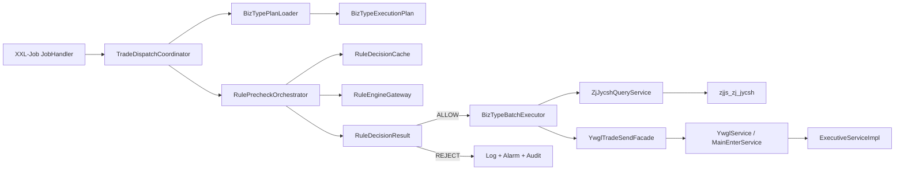
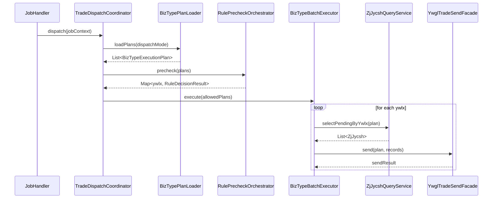

# 自动发交易任务按 `ywlx` 业务类型编码分组与规则引擎驱动详细设计

**文档编号**：GJJ-ZJJS-YWGL-DD-20260427-01  
**适用系统**：`capinfo-gjj-busi-zjjs-ywgl`  
**设计类型**：详细设计  
**版本**：V1.0  
**编制日期**：2026-04-27  
**说明**：本详细设计以“业务类型 = 实际业务类型编码 `ywlx`”为唯一正确口径，修正前期将 `Plyw/Dbyw` 误当作业务类型的方案偏差。`Plyw/Dbyw` 在本设计中仅作为调度模式或发送形态，不再作为业务类型定义。

## 1. 设计背景

当前自动发交易任务以 `ZjbPlywJobHandler`、`ZjbDbywJobHandler` 等 XXL-Job 任务为入口，通过构造 `ZjJycsh` 查询条件扫描初始化表，再调用 `YwglService.jyfs` 逐笔执行发送。现有机制能满足基础发送要求，但存在以下问题：

- 调度层无法直接识别真实业务类型 `ywlx`，只能依赖 `plbj + execode/txcode + isSearch` 组合条件间接筛选。
- 规则引擎调用位于 `jyfs` 的逐笔循环内部，无法实现“按业务类型整组预检”。
- 初始化表 `zjjs_zj_jycsh` 中未固化 `ywlx`，导致若要按业务类型预检，必须先回源查付款/收款业务详情，数据库开销大、链路长。
- `Plyw/Dbyw`、发送/查询、执行编码路由与真实业务语义混杂，后续扩展和配置治理困难。

本详细设计的目标是在不破坏现有发送执行器、事务、重试、幂等机制的前提下，引入一层“按 `ywlx` 分组”的统一调度和预检能力。

## 2. 设计范围

本次详细设计覆盖以下内容：

- 自动发交易任务的调度编排层重构
- `ywlx` 业务类型编码维度的分组预检设计
- 规则引擎网关、缓存、灰度、回退设计
- 数据库结构调整与历史数据回填设计
- 配置中心、日志埋点、监控告警设计
- 测试、上线与回滚设计

本次详细设计不覆盖以下内容：

- 各 `ExecutiveServiceImpl` 具体打包报文结构调整
- 银行侧报文协议修改
- 现有付款/收款业务主表字段含义调整

## 3. 术语定义

### 3.1 业务类型

本设计中“业务类型”专指业务领域编码 `ywlx`，例如：

- `11101`：缴存
- `11202`：提取
- `11305`：贷款扣款
- `zjdb`：资金调拨
- `sxfzc`：手续费支出

对应枚举参考 `YwlxEnum`。

### 3.2 调度模式

调度模式用于描述任务处理形态，不代表业务类型，仅作为扫描维度和路由辅助字段：

- `DB_SEND`：单笔发送
- `PL_SEND`：批量发送
- `DB_QUERY`：单笔查询
- `PL_QUERY`：批量查询

### 3.3 初始化记录

初始化记录指表 `zjjs_zj_jycsh` 中的待发送/待查询中间记录，是本次调度扫描与重试的基表。

## 4. 现状分析

### 4.1 现有任务链路

现有任务链路如下：

1. XXL-Job 触发 `ZjbPlywJobHandler` / `ZjbDbywJobHandler`
2. JobHandler 组装 `ZjJycsh` 查询条件
3. `ZjJycshDmServiceImpl.selectList` 从初始化表中查询待处理记录
4. `YwglServiceImpl.jyfs` 逐笔查询付款/收款详情
5. `YwglServiceImpl.jyfs` 逐笔调用交易控制规则
6. 满足发送条件后调用 `MainEnterService.call`
7. `MainEnterServiceImpl` 根据 `execode` 路由到对应执行器

### 4.2 现有链路存在的问题

#### 4.2.1 业务类型语义缺失

初始化表中无 `ywlx` 字段，扫描层无法直接得知记录属于哪种业务类型，只能在 `jyfs` 里逐笔回源查询。

#### 4.2.2 规则调用位置过后

现有规则引擎控制发生在单笔发送内部，无法先判断“某个 `ywlx` 本轮是否整体允许发送”。

#### 4.2.3 调度与业务耦合方式不稳定

当前用 `plbj`、`exeCodes`、`txCodes`、`isSearch` 来筛选记录，这些条件更接近技术路由维度，而不是稳定业务维度。

#### 4.2.4 缺少按业务类型的资源治理

没有按 `ywlx` 配置优先级、并发数、缓存、灰度和监控的能力。

## 5. 总体设计原则

- 以 `ywlx` 作为唯一业务类型主键
- 保持现有 `MainEnterService -> ExecutiveServiceImpl` 执行出口不变
- 保持现有事务、重试、幂等、回执链路不变
- 尽量将重构控制在调度编排层、配置层和规则层
- 调度扫描优先依赖初始化表快照字段，避免任务运行时大量回源查询
- 规则异常时默认“放行但告警”，防止因规则中心故障阻断主交易

## 6. 目标架构

### 6.1 架构概览



### 6.2 架构分层

#### 6.2.1 任务触发层

- `ZjbPlywJobHandler`
- `ZjbDbywJobHandler`
- `ZjbPlJycxJobHandler`
- `ZjbJycxJobHandler`

职责：

- 保留原 XXL-Job 名称，避免调度平台配置大改
- 不再直接拼接大段业务类型列表
- 统一委托 `TradeDispatchCoordinator`

#### 6.2.2 调度编排层

- `TradeDispatchCoordinator`
- `BizTypePlanLoader`
- `BizTypeBatchExecutor`

职责：

- 加载启用的 `ywlx` 业务类型计划
- 按优先级/权重排序
- 先执行规则预检
- 再触发按业务类型分页发送

#### 6.2.3 规则预检层

- `RulePrecheckOrchestrator`
- `RuleEngineGateway`
- `RuleDecisionCache`
- `RuleVersionRouter`

职责：

- 构造预检请求
- 调用规则引擎
- 做 30 秒缓存
- 进行版本灰度与异常兜底

#### 6.2.4 发送适配层

- `YwglTradeSendFacade`

职责：

- 将 `BizTypeExecutionPlan` 转换为 `ZjJycsh` 查询条件
- 调用现有 `YwglService` 发送能力
- 屏蔽旧接口与新编排层之间的差异

## 7. 关键领域模型设计

### 7.1 业务类型执行计划 `BizTypeExecutionPlan`

```java
public class BizTypeExecutionPlan {
    private String ywlx;
    private String dispatchMode;
    private String plbj;
    private Boolean search;
    private Integer batchSize;
    private Integer priority;
    private Integer weight;
    private Integer maxConcurrency;
    private String ruleSetId;
    private String bankScope;
    private List<String> includeExecodes;
    private List<String> excludeExecodes;
    private List<String> txCodes;
    private Boolean enabled;
}
```

字段说明：

- `ywlx`：业务类型编码，主键字段
- `dispatchMode`：调度模式，例如 `DB_SEND`
- `plbj`：单笔/批量标记
- `search`：是否查询任务
- `batchSize`：单轮扫描批次大小，默认 20
- `priority`：优先级，数值越大优先级越高
- `weight`：同优先级下加权轮询权重
- `maxConcurrency`：该 `ywlx` 最大并发度

### 7.2 规则预检请求 `RuleDecisionRequest`

```java
public class RuleDecisionRequest {
    private String taskId;
    private String ywlx;
    private String dispatchMode;
    private String bankCode;
    private String regionCode;
    private Integer waitingCount;
    private TradeFeatureSnapshot tradeSnapshot;
    private CustomerFeatureSnapshot customerSnapshot;
    private RuleContext ruleContext;
}
```

设计说明：

- 入参必须携带 `ywlx`
- `dispatchMode` 只是辅助判断条件
- `waitingCount` 用于支持某些“积压量触发型”规则

### 7.3 规则预检结果 `RuleDecisionResult`

```java
public class RuleDecisionResult {
    private Boolean allowSend;
    private String reasonCode;
    private String reasonDesc;
    private String ruleVersion;
    private Boolean fallback;
    private Long costMs;
    private List<String> extraActions;
}
```

## 8. 数据库详细设计

### 8.1 数据库改造总原则

- 主改初始化表，不大范围改动业务主表
- 调度所需的稳定业务语义必须在初始化表中快照化
- 审计与监控数据尽量异步落库，不侵入主发送事务

### 8.2 初始化表改造

#### 8.2.1 改造目标

使 `zjjs_zj_jycsh` 在任务扫描阶段即可得到真实业务类型 `ywlx`，避免调度层逐笔回源。

#### 8.2.2 新增字段

建议对 `zjjs_zj_jycsh` 增加以下字段：

| 字段名 | 类型 | 是否必填 | 说明 |
|---|---|---|---|
| `ywlx` | varchar(32) | 否，迁移期允许空 | 业务类型编码快照 |
| `dispatch_mode` | varchar(16) | 否 | 调度模式快照，如 `DB_SEND` |
| `rule_precheck_time` | datetime | 否 | 最近一次预检时间 |
| `rule_precheck_result` | varchar(16) | 否 | 最近一次预检结果 |

其中：

- `ywlx` 为核心字段，必须新增
- `dispatch_mode` 可选，但建议增加，便于后续审计与统计
- `rule_precheck_time`、`rule_precheck_result` 为可选增强字段；若你们更倾向轻量化，也可以不放主表，改用审计表记录

#### 8.2.3 索引设计

建议新增如下索引：

| 索引名 | 字段 | 目的 |
|---|---|---|
| `idx_jycsh_fszt_ywlx_crsj` | `fszt, ywlx, crsj` | 按状态 + 业务类型 + 时间扫描 |
| `idx_jycsh_fszt_ywlx_yhdm_crsj` | `fszt, ywlx, yhdm, crsj` | 按银行维度扫描 |
| `idx_jycsh_ywlx_plbj_execode` | `ywlx, plbj, execode` | 发送模式与执行路由组合筛选 |

说明：

- 高频过滤条件仍然是 `fszt` 与 `crsj`
- `ywlx` 必须进入联合索引前缀，否则按业务类型扫描收益有限

#### 8.2.4 DDL 草案

```sql
ALTER TABLE zjjs_zj_jycsh
    ADD COLUMN ywlx VARCHAR(32) NULL COMMENT '业务类型编码快照' AFTER sqbid,
    ADD COLUMN dispatch_mode VARCHAR(16) NULL COMMENT '调度模式快照' AFTER ywlx,
    ADD COLUMN rule_precheck_time DATETIME NULL COMMENT '最近一次预检时间' AFTER crsj,
    ADD COLUMN rule_precheck_result VARCHAR(16) NULL COMMENT '最近一次预检结果' AFTER rule_precheck_time;

CREATE INDEX idx_jycsh_fszt_ywlx_crsj
    ON zjjs_zj_jycsh (fszt, ywlx, crsj);

CREATE INDEX idx_jycsh_fszt_ywlx_yhdm_crsj
    ON zjjs_zj_jycsh (fszt, ywlx, yhdm, crsj);

CREATE INDEX idx_jycsh_ywlx_plbj_execode
    ON zjjs_zj_jycsh (ywlx, plbj, execode);
```

### 8.3 规则预检审计表设计

#### 8.3.1 设计目标

记录每轮任务、每个 `ywlx` 的规则预检结果，支撑以下场景：

- 规则命中原因追踪
- 预检效果分析
- 灰度对比
- 故障审计

#### 8.3.2 表名建议

`zjjs_zj_rule_precheck_log`

#### 8.3.3 字段设计

| 字段名 | 类型 | 说明 |
|---|---|---|
| `id` | bigint | 主键 |
| `task_id` | varchar(64) | 任务实例 ID |
| `batch_no` | varchar(64) | 批次号 |
| `ywlx` | varchar(32) | 业务类型编码 |
| `dispatch_mode` | varchar(16) | 调度模式 |
| `yhdm` | varchar(32) | 银行代码 |
| `waiting_count` | int | 待处理记录数 |
| `rule_set_id` | varchar(64) | 规则集标识 |
| `rule_version` | varchar(32) | 规则版本 |
| `decision_result` | varchar(16) | ALLOW/REJECT/FALLBACK |
| `reason_code` | varchar(64) | 原因码 |
| `reason_desc` | varchar(256) | 原因描述 |
| `cost_ms` | bigint | 规则耗时 |
| `fallback_flag` | char(1) | 是否降级 |
| `created_time` | datetime | 创建时间 |

#### 8.3.4 索引建议

| 索引名 | 字段 |
|---|---|
| `idx_rule_precheck_task` | `task_id` |
| `idx_rule_precheck_ywlx_time` | `ywlx, created_time` |
| `idx_rule_precheck_version_time` | `rule_version, created_time` |

### 8.4 历史数据回填设计

#### 8.4.1 回填范围

优先回填以下初始化记录：

- `fszt = 0` 的待发送记录
- 正在重试中的失败记录
- 查询类未完成记录

#### 8.4.2 回填来源

回填逻辑与现有 `jyfs` 保持一致：

1. 先按 `sqbid + jslsh` 查询付款业务详情
2. 若为空，再查询收款业务详情
3. 取详情中的 `ywlx`
4. 回写 `zjjs_zj_jycsh.ywlx`

#### 8.4.3 回填脚本执行策略

- 按时间分片执行，避免长事务
- 每批 1000 条提交一次
- 记录成功数、失败数、空业务类型数
- 对回填失败的记录生成补偿清单

### 8.5 回滚策略

- 若详细设计上线后发现 `ywlx` 快照写入有误，不回退表结构，只停用新逻辑
- 通过配置关闭新调度器，恢复旧 `jyfs` 直连方式
- 保留新增字段，待修复后重新灰度启用

## 9. 配置中心详细设计

### 9.1 配置模型

```yaml
trade.dispatch:
  enabled: true
  default-batch-size: 20
  precheck:
    enabled: true
    timeout-ms: 500
    cache-ttl-seconds: 30
    core-pool-size: 4
    max-pool-size: 8
    queue-size: 100
  rule:
    endpoint: http://rule-engine/api/precheck
    default-version: v1
    gray-routes:
      - ywlx: 11101
        version: v2
        ratio: 20
      - ywlx: sxfzc
        version: v2
        ratio: 100
  biz-plans:
    - ywlx: 11101
      dispatch-mode: DB_SEND
      plbj: F
      search: false
      batch-size: 20
      priority: 100
      weight: 5
      max-concurrency: 2
      include-execodes: [bdc101, bdc102]
    - ywlx: sxfzc
      dispatch-mode: PL_SEND
      plbj: S
      search: false
      batch-size: 20
      priority: 90
      weight: 3
      max-concurrency: 1
      exclude-execodes: [ecs221a]
```

### 9.2 配置校验规则

- `ywlx` 不允许为空
- `batch-size` 必须大于 0，默认 20
- `priority` 必须在 1 到 999 间
- `max-concurrency` 不得超过全局线程池容量
- 灰度规则中的 `ratio` 必须在 0 到 100 间

### 9.3 动态热更新规则

- Apollo/Nacos 配置变更后由监听器刷新内存快照
- 先做配置合法性校验
- 校验通过后替换 `activePlanSnapshot`
- 校验失败保留旧配置并告警

## 10. 任务执行详细流程设计

### 10.1 总体时序



### 10.2 任务触发阶段

输入：

- 任务名
- 当前时间
- 调度模式

输出：

- `taskId`
- 需要执行的 `BizTypeExecutionPlan` 列表

处理规则：

- 由旧 JobHandler 根据自身语义传入 `dispatchMode`
- 例如 `ZjbDbywJobHandler` 传入 `DB_SEND`
- `ZjbPlywJobHandler` 传入 `PL_SEND`

### 10.3 计划加载阶段

处理规则：

- 从配置中心加载启用的 `biz-plans`
- 过滤出与当前 `dispatchMode` 相匹配的计划
- 按 `priority desc, weight desc, ywlx asc` 排序

### 10.4 预检阶段

处理步骤：

1. 读取某个 `ywlx` 在初始化表中的待处理条数
2. 抽取代表性样本特征
3. 构造 `RuleDecisionRequest`
4. 查询缓存
5. 若缓存未命中则调用规则引擎
6. 将结果写入缓存和审计表
7. 返回决策结果

缓存键设计：

`ywlx + dispatchMode + bankCode + ruleVersion + featureHash`

### 10.5 批量发送阶段

处理步骤：

1. 调用 `ZjJycshQueryService.selectPendingByPlan(plan)`
2. 每个 `ywlx` 每轮最多扫描 `batchSize` 条
3. 交由 `YwglTradeSendFacade.send(plan, records)` 执行
4. `YwglTradeSendFacade` 内部调用现有 `YwglService` 或抽出的公共发送方法
5. 保持逐笔发送与旧路由逻辑一致

### 10.6 异常处理

- 规则引擎超时或异常：放行并告警
- 某个 `ywlx` 批量发送失败：只影响当前 `ywlx` 本轮执行，不阻断其他业务类型
- 单笔发送失败：保留现有失败状态与重试逻辑

## 11. 查询服务详细设计

### 11.1 新增查询接口

建议新增：

```java
public interface ZjJycshQueryService {
    List<ZjJycsh> selectPendingByPlan(BizTypeExecutionPlan plan);
    Integer countPendingByPlan(BizTypeExecutionPlan plan);
}
```

### 11.2 查询条件映射

| 计划字段 | 查询条件 |
|---|---|
| `ywlx` | `eq(ywlx, plan.getYwlx())` |
| `plbj` | `eq(plbj, plan.getPlbj())` |
| `search` | `execode like '%_%'` 或 `not like '%_%'` |
| `includeExecodes` | `in(execode, includeExecodes)` |
| `excludeExecodes` | `notIn(execode, excludeExecodes)` |
| `txCodes` | `in(txcode, txCodes)` |
| 固定条件 | `fszt = 0 and crsj <= now()` |

### 11.3 SQL 伪代码

```sql
SELECT *
  FROM zjjs_zj_jycsh
 WHERE fszt = '0'
   AND crsj <= NOW()
   AND ywlx = #{plan.ywlx}
   AND plbj = #{plan.plbj}
   AND (
       (#{plan.search} = false AND execode NOT LIKE '%\\_%')
       OR
       (#{plan.search} = true AND execode LIKE '%\\_%')
   )
 ORDER BY crsj ASC
 LIMIT #{plan.batchSize}
```

## 12. 规则引擎详细设计

### 12.1 网关接口

```java
public interface RuleEngineGateway {
    RuleDecisionResult precheck(RuleDecisionRequest request);
}
```

### 12.2 请求示例

```json
{
  "taskId": "20260427-DBSEND-0001",
  "ywlx": "11101",
  "dispatchMode": "DB_SEND",
  "bankCode": "ABC",
  "waitingCount": 235,
  "tradeSnapshot": {
    "sampleExecodes": ["bdc101", "bdc102"],
    "sampleTxCodes": ["tx01"],
    "search": false
  },
  "ruleContext": {
    "ruleSetId": "trade-precheck",
    "candidateVersions": ["v1", "v2"],
    "grayTag": "bank-ABC"
  }
}
```

### 12.3 返回示例

```json
{
  "allowSend": true,
  "reasonCode": "PASS",
  "reasonDesc": "业务类型11101允许发送",
  "ruleVersion": "v2",
  "fallback": false,
  "costMs": 86,
  "extraActions": []
}
```

### 12.4 版本路由规则

- 优先读取 `gray-routes`
- 若 `ywlx + bankCode` 命中灰度规则，走灰度版本
- 未命中时走默认版本

## 13. 类设计

### 13.1 新增类清单

| 类名 | 职责 |
|---|---|
| `TradeDispatchCoordinator` | 统一调度总控 |
| `BizTypePlanLoader` | 加载 `ywlx` 业务类型计划 |
| `BizTypeBatchExecutor` | 执行业务类型批次发送 |
| `RulePrecheckOrchestrator` | 规则预检协调器 |
| `RuleVersionRouter` | 规则版本灰度路由 |
| `RuleDecisionCache` | 30 秒预检缓存 |
| `YwglTradeSendFacade` | 新编排层到旧发送服务的适配 |
| `ZjJycshQueryService` | 按计划查询初始化记录 |
| `TradeDispatchProperties` | 配置模型 |

### 13.2 现有类修改清单

| 类名 | 修改点 |
|---|---|
| `ZjbPlywJobHandler` | 改为调用 `TradeDispatchCoordinator.dispatch(PL_SEND)` |
| `ZjbDbywJobHandler` | 改为调用 `TradeDispatchCoordinator.dispatch(DB_SEND)` |
| `ZjbPlJycxJobHandler` | 改为调用 `TradeDispatchCoordinator.dispatch(PL_QUERY)` |
| `ZjbJycxJobHandler` | 改为调用 `TradeDispatchCoordinator.dispatch(DB_QUERY)` |
| `ZjJycsh` | 增加 `ywlx`、`dispatchMode` 运行时属性 |
| `ZjJycshDO` | 增加 `ywlx`、`dispatchMode` 映射字段 |
| `ZjJycshDmServiceImpl` | 增加按 `BizTypeExecutionPlan` 查询方法 |
| `YwglServiceImpl` | 抽取公共发送方法供 `Facade` 复用 |

## 14. 并发与性能设计

### 14.1 线程池设计

预检线程池：

- 核心线程数：4
- 最大线程数：8
- 队列长度：100
- 拒绝策略：`CallerRunsPolicy`

业务类型发送并发控制：

- 每个 `ywlx` 有独立 `Semaphore`
- 信号量大小取 `plan.maxConcurrency`
- 防止某一业务类型抢占全部发送资源

### 14.2 性能控制点

- 预检缓存 TTL 固定 30 秒
- 单个 `ywlx` 每轮只取 `batchSize` 条
- 查询严格走联合索引
- 审计表写入异步化

## 15. 日志与监控详细设计

### 15.1 JSON 日志格式

预检日志：

```json
{
  "event": "trade_rule_precheck",
  "taskId": "20260427-DBSEND-0001",
  "ywlx": "11101",
  "dispatchMode": "DB_SEND",
  "waitingCount": 235,
  "ruleVersion": "v2",
  "decisionResult": "ALLOW",
  "reasonCode": "PASS",
  "costMs": 86,
  "fallback": false
}
```

发送日志：

```json
{
  "event": "trade_batch_send",
  "taskId": "20260427-DBSEND-0001",
  "batchNo": "11101-0001",
  "ywlx": "11101",
  "dispatchMode": "DB_SEND",
  "recordCount": 20,
  "successCount": 20,
  "failCount": 0,
  "costMs": 312
}
```

### 15.2 Grafana 指标

- `trade_rule_precheck_total`
- `trade_rule_precheck_reject_total`
- `trade_rule_precheck_fallback_total`
- `trade_dispatch_batch_total`
- `trade_dispatch_batch_cost_ms`
- `trade_dispatch_record_fail_total`

维度标签：

- `ywlx`
- `dispatchMode`
- `bankCode`
- `ruleVersion`

## 16. 灰度、上线与回滚设计

### 16.1 灰度顺序

建议按以下顺序逐步接入：

1. `ywlx = 11101`
2. `ywlx = 11202`
3. `ywlx = sxfzc`
4. 其他低风险业务类型

### 16.2 开关设计

全局开关：

- `trade.dispatch.enabled`
- `trade.dispatch.precheck.enabled`

业务类型级开关：

- `trade.dispatch.biz-plans[].enabled`

### 16.3 回滚策略

- 关闭 `trade.dispatch.precheck.enabled`：保留新调度器，只跳过规则预检
- 关闭 `trade.dispatch.enabled`：整体回切到旧 Job 直调 `jyfs`
- 不删除新增表字段，避免重复 DDL

## 17. 测试设计

### 17.1 单元测试

覆盖点：

- 按 `ywlx` 分组是否正确
- 配置热更新是否生效
- 灰度版本路由是否正确
- 缓存命中与失效是否符合预期
- 规则超时是否触发放行兜底

### 17.2 集成测试

场景：

- `1w` 笔初始化记录
- `4` 个 `ywlx` 并发
- 同时覆盖 `DB_SEND` 与 `PL_SEND`
- 模拟规则中心正常、超时、异常三类场景

指标：

- CPU `<= 60%`
- RT `<= 800 ms`
- 错发 `= 0`
- 规则拦截率与预期一致

### 17.3 数据库专项测试

- `ywlx` 新增字段写入正确率 `100%`
- 历史回填准确率 `100%`
- 新索引下查询耗时较旧逻辑明显下降
- 灰度期新旧链路结果一致

## 18. 实施步骤建议

### 18.1 第一期：库表准备

1. 新增 `zjjs_zj_jycsh.ywlx`
2. 新增规则预检审计表
3. 上线新字段映射但不启用新调度

### 18.2 第二期：写入与回填

1. 初始化记录生成链路开始写入 `ywlx`
2. 执行历史待处理记录回填
3. 完成索引创建

### 18.3 第三期：调度与预检灰度

1. 上线 `TradeDispatchCoordinator`
2. 先灰度单个 `ywlx`
3. 扩大到多个 `ywlx`

### 18.4 第四期：全量切换

1. 新调度器全量接管
2. 旧 Job 保留桥接能力
3. 稳定后再考虑是否下线旧条件拼装逻辑

## 19. 风险与对策

| 风险 | 说明 | 对策 |
|---|---|---|
| `ywlx` 快照缺失 | 历史记录无 `ywlx` | 回填 + 运行时兜底 |
| 规则中心故障 | 影响预检 | 默认放行并告警 |
| 新索引效果不佳 | 数据分布不均 | 先灰度评估执行计划 |
| 配置误配 | 错误的 `ywlx` 计划 | 配置校验 + 审计 |
| 新旧逻辑结果不一致 | 灰度期间风险 | 双轨比对 + 审计表复盘 |

## 20. 结论

本详细设计的核心不是“把任务按单笔/批量分组”，而是“把真实业务类型 `ywlx` 前移到调度扫描层，并在其之上构建规则预检、并发治理、监控审计和灰度回退能力”。这样既能保持现有执行器和事务链路稳定，又能使新方案真正围绕实际业务类型编码落地。
