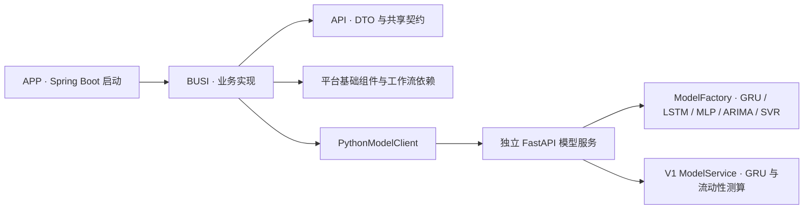
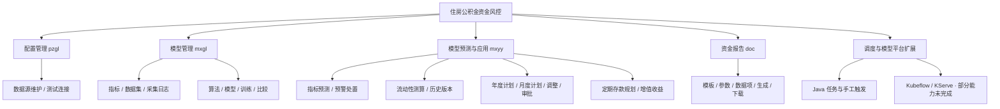
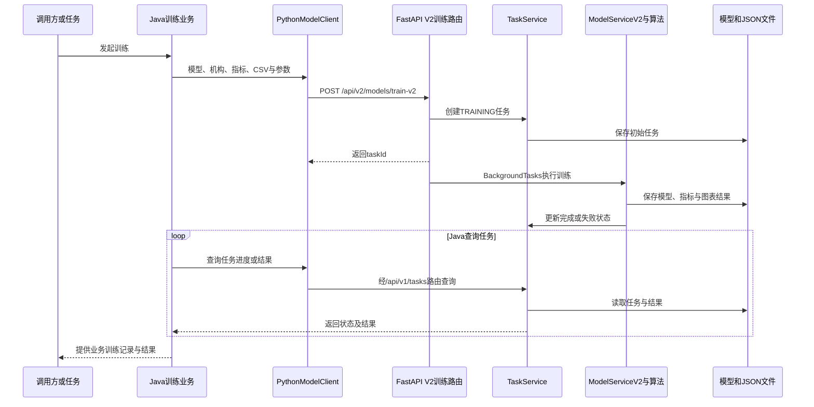
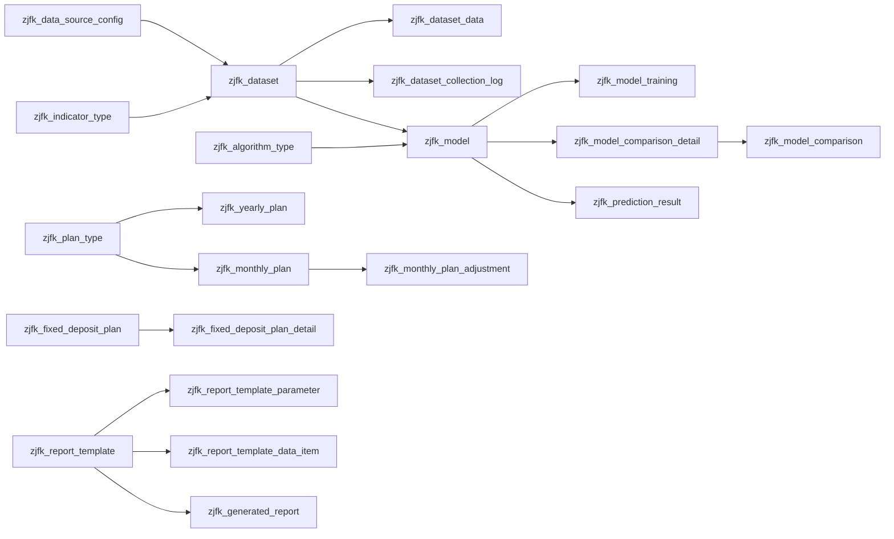
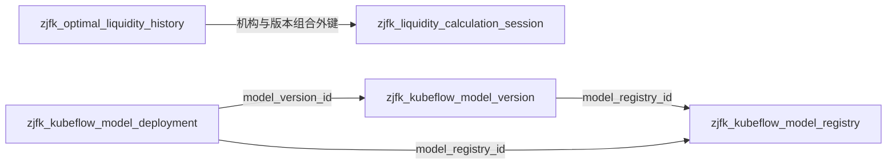
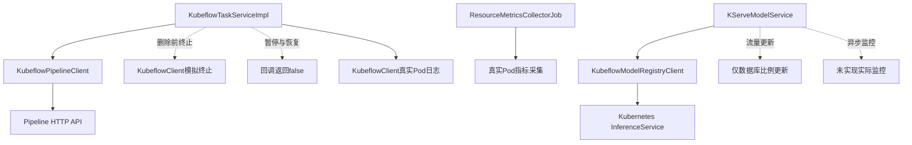
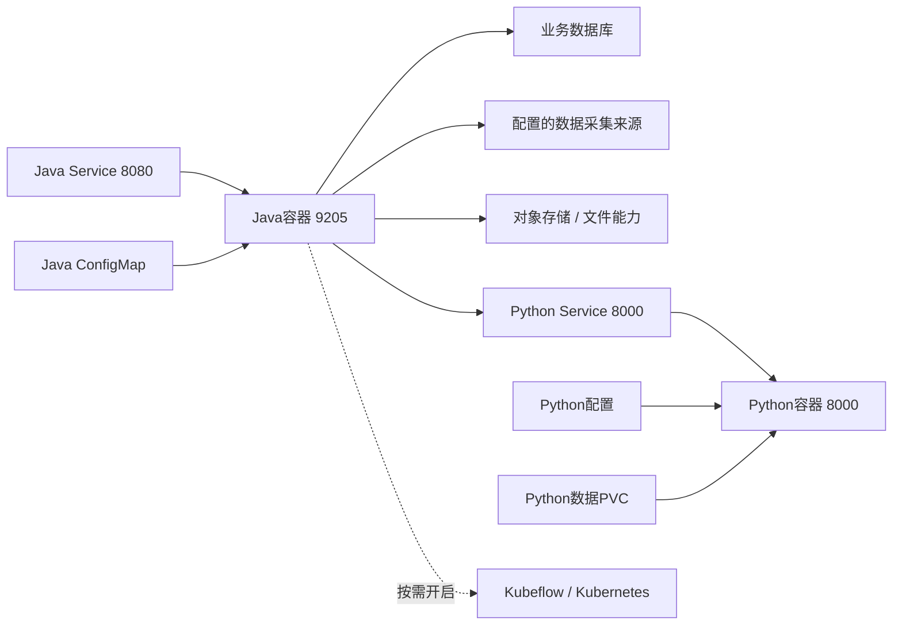

# zjfk 项目图谱

基线：2026-09-14，提交 `ea480f0687ff441a5e08422beb2095f28e3f5a4e`。路径缩写见 `项目详细介绍.md`。本页是人工核对的概念与流程图；源码导航关系见 `knowledge-graph.json`。

## 1. 工程依赖图

箭头表示构建依赖或明确 HTTP 调用。Python 不属于 Maven 子模块。

证据：三个子模块 `pom.xml`、`B/mxgl/utils/PythonModelClient.java:68`、`P/app/main.py:48`、`P/app/services/model_service_v2.py:29`。

## 2. 业务能力全景

从左到右是能力分组，不代表每次请求均执行所有节点。实际业务链路可能由定时任务或人工操作分别触发。

证据：24 个控制器的基础路径与方法映射，详见 `接口与数据索引.md` 控制器表。

## 3. 跨语言训练时序

这里展示 V2 训练主链与 V1 任务查询组合。返回任务号只代表受理，模型训练和业务记录回写在之后发生。

证据：`B/mxgl/utils/PythonModelClient.java:68`、`:121`、`:191`；`P/app/api/routes/models_v2.py:70`；`P/app/services/model_service_v2.py:145`。时序图为源码流程概括，不含事务一致性承诺。

## 4. 流动性测算与历史版本

```mermaid
flowchart LR
  INPUT["历史流动资金数据"] --> JAVA["Java测算业务"]
  JAVA --> PY["POST /api/v1/liquidity/optimize"]
  PY --> CLEAN["过滤非正数 / 样本检查"]
  CLEAN --> FIT["对数正态拟合 / KS检验"]
  FIT --> SIM["蒙特卡洛模拟"]
  SIM --> QUANTILE["10% / 50% / 90%分位数及图表"]
  QUANTILE --> RESULT["返回测算结果"]
  RESULT --> VERSION["Java保存历史会话和结果"]
  VERSION --> MANAGE["查询 / 激活 / 比较 / 清理"]
```

此图没有把“测算”画成收益最大化求解；版本管理由 Java 提供，不由 Python 训练任务承担。证据：`P/app/services/model_service.py:757`、`B/mxyy/ycjg/controller/ZjldzjcylcsController.java:45`。

## 5. 数据关系图（两种证据强度）

### 5.1 业务逻辑关联

本图箭头表示字段/业务关联，不表示数据库已创建外键，也不承诺所有关系的强制基数。

证据：`数据库设计/zjfk_db.sql` 相应建表字段及 33 个实体映射；逐表位置见 `接口与数据索引.md`。源脚本中没有直接实体映射的表也保留在索引中，不推断为废弃表。

### 5.2 DDL 明确声明的外键

证据：`数据库设计/zjfk_db.sql:579`、`:1051`、`:1102`。这是脚本关系，未连接实际数据库确认约束存在。

## 6. Kubeflow 能力边界图

实线表示有真实调用代码；虚线表示模拟、未完成或无法据此证明远端操作发生。所有真实调用也均未联调。

证据：`B/kubeflow/service/impl/KubeflowTaskServiceImpl.java:183`、`:195`、`:215`；`B/kubeflow/service/KServeModelService.java:181`、`:365`；`B/kubeflow/client/KubeflowModelRegistryClient.java:389`。

## 7. 部署结构

这是仓库配置和代码依赖视图，不是现网网络拓扑。未收录私有地址、账号或连接串。证据：`k8s/dev-tsp/` 两个部署文件、数据源服务与 `PythonModelClient`。

## 8. 机器图谱怎么使用

`knowledge-graph.json` 使用本项目自定义 `zjfk-static-graph/1.0` 格式，不伪装成 understand 插件原生输出，也没有进行完整 AST 分析。

| 关系 | 含义 | 不能据此推断 |
|---|---|---|
| contains | 项目、分组、文件包含关系 | 运行时加载或调用 |
| imports | Java 显式、可解析的内部导入 | 该方法一定执行或 Bean 一定注入 |
| maps_to | Java 实体映射数据库表 | 真实数据库表已经创建 |
| sql_references | Mapper XML 引用表名 | 所有动态 SQL 或精确读写范围 |
| defines_schema | SQL 非行注释建表声明 | 迁移已执行 |
| routes | Controller 或已挂载 Python 路由 | 鉴权通过、接口在线或测试通过 |
| depends_on | 当前 Maven 模块显式依赖 | 完整传递依赖树 |

每条关系包含源码文件与行号，inventory 带文本内容指纹。Python 算法内部调用没有自动抽取，已通过本页概念图补充；反射、动态 SQL、Feign 外部实现和框架隐式关系均不冒充完整覆盖。

按 endpoint 节点查接口，反查 `routes` 找 Controller；按文件节点的 `imports` 找静态类型依赖；按 table 节点查 `maps_to` 和 `sql_references` 找实体及 Mapper。搜索业务关键词则优先使用本文和详细介绍，不要在 764 个节点中盲目扩散。
